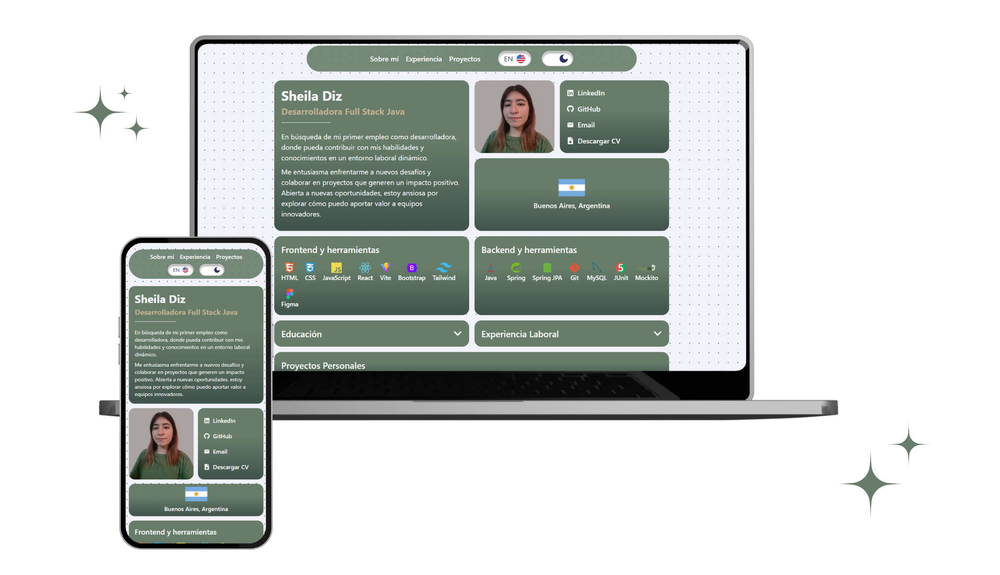

<h2 align="center">
  Portfolio Website 
  <a href="https://sheiladiz.vercel.app/" target="_blank">sheiladiz.vercel.app</a>
</h2>

  

 

## Tecnologías utilizadas

Mi portfolio personal contiene mis proyectos de github, además de mis habilidades y conocimientos. 

Este proyecto fue construido usando estas tecnologias y herramientas:

- React
- Vite
- Tailwind
- CSS3
- Framer Motion
- VsCode
- Vercel
